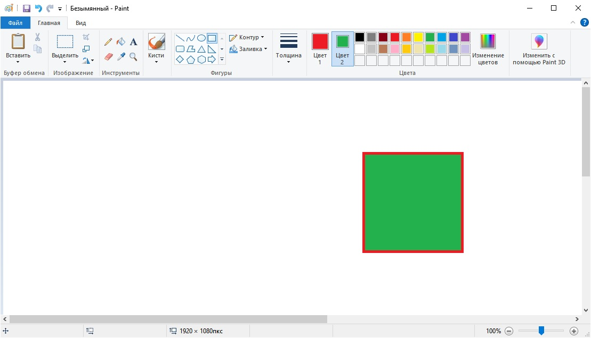

# Документация к Microsoft Paint #
**Paint** – графический редактор, который позволяет производить простые операции с изображениями. Поставляется в комплекте с операционной системой Windows.

## Основные функции ##
1.	Рисование:
    - От руки в свободной форме с помощью инструментов "Карандаш" и "Кисть";
    - Создание стандартных геометрических фигур и других графических элементов с заливкой и без нее;
    - Добавление текста на изображение.
2.	Создание комбинированного изображения посредством копирования и вставки отдельных графических фрагментов.
3.	Обрезка изображения по указанному пользователем контуру.
4.	Изменения размера и ориентации изображения.
5.	Просмотр изображения в различных масштабах с использованием сетки и линейки.
6.	Сохранение изображения в различных форматах (PNG, JPEG, GIF и др.).

## Возможные способы применения ##
1. Быстрое создание скриншотов с поясняющими графическими элементами и надписями.
2. Создание блок-схем и диаграмм.
3. Простые коллажи.
4. Сжатие размера файла изображения преобразованием в другой формат.
5. И другое.

## Основные действия ##

#### Создание файла ####
При открытии программы Paint новый файл создается автоматически. Можно сразу же приступать к работе. Если у Вас уже открыт файл, и Вы хотите создать новый, то выпоните следующие действия:
1. Перейдите в меню "Файл". 
2. Выберите пункт "Создать".

    

   *Меню "Файл"->"Создать"*

3. Поскольку программа не может работать одновременно с несколькими файлами, то текущий открытый файл будет закрыт. Программа выдаст диалоговое окно, в котором нужно указать, сохранять текущий файл или нет.

#### Открытие файла ####
1. Перейдите в меню "Файл". 
2. Выберите пункт "Открыть".

    
   
    *Меню "Файл"->"Открыть"*

3. В появившемся диалоговом окне выберите файл и нажмите кнопку "Открыть" или дважды нажмите левой кнопкой мыши по файлу.

#### Сохранение файла ####
1. Перейдите в меню "Файл". 
2. Выберите пункт "Сохранить" или "Сохранить как...".

    
   
    *Меню "Файл"->"Сохранить"*

3. В появившемся диалоговом окне укажите путь, куда нужно сохранить файл, имя файла, а также формат (расширение), и нажмите кнопку "Сохранить".

#### Вырезать объект и вставить его на новый фон ####
1.	Откройте файл изображения с объектом, который необходимо перенести на новый фон.
2.	На вкладке "Главная" в разделе "Изображение" верхней панели нажмите пункт "Выделить".

    
  	
    *Пункт "Выделить" верхней панели вкладки "Главное"*

3.	В появившемся меню выберите тип выделения "Прямоугольная область" или "Произвольная область".

  	"Произвольная область" работает аналогично инструменту "Кисть" и позволяет выделить объект по контуру движением мыши. "Прямоугольная область" выделяет прямоугольный фрагмент изображения.

    
  	
    *Пункт "Выделить" верхней панели вкладки "Главное"*

    

4.	Если Вы выбрали пункт "Прямоугольная область", то переместите курсор на холст изображения в точку, в которой находится левый верхний угол прямоугольника желаемой области выделения и нажмите и удерживайте левую кнопку мыши, и потяните курсор вправо вниз. После того, как контур выделения покроет нужную вам область, отпустите левую кнопку мыши.

    
  	
    *Пример выделения инструментом "Прямоугольная область"*

5.	Если Вы выбрали "Произвольная область", то переместите курсор на холст изображения в точку, лежащей на контуре объекта, который нужно выделить. Нажмите и удерживайте левую кнопку мыши, и обведите объект движением мыши. Вернитесь в исходную точку, с которой начинается контур. Отпустите левую кнопку мыши. Появится контур в виде прямоугольника, который обозначит границы обведенного вами контура.

    
  	
    *Пример выделения инструментом "Произвольная область"*

6.	Для копирования объекта нажмите сочетание клавиш Ctrl+C или щелкните по выделенной области правой кнопкой мыши и в появившемся контекстном меню выберите пункт "Копировать".
7. Откройте новый экземпляр программы Paint через меню "Пуск" операционной системы Windows.
8. В новом экземпляре программы откройте файл, в который необходимо добавить скопированный фрагмент.

    
    
    *Открываем файл, который будет выступать в качестве фона, в отдельном экземпляре программы Paint*

9. Нажмите сочетание клавиш Ctrl+V или щелкните правой кнопкой мыши по холсту изображения и в появившемся контекстном меню выберите пункт "Вставить".

    
    
    *Результат вставки вырезанного фрагмента в другое изображение*

10. Передвиньте появившийся фрагмент на новое место. Для этого наведите курсор мыши на фрагмент, нажмите и удерживайте левую кнопку мыши, и начните перемещать мышь. После достижения нужного результат отпустите левую кнопку мыши.

    Учтите, что фрагмент доступен для редактирования, пока он имеет контур выделения. Если контур выделения исчез, то необходимо выполнить все действия по вставке фрагмента заново.  

11. Размер вставленного фрагмента можно изменить, если навести курсор мыши на контур выделения фрагмента. Курсор мыши при этом изменит свою форму на двунаправленную стрелку. Необходимо нажать и удерживать левую кнопку мыши, и движением мыши изменить размеры фрагмента на желаемые.

    
    
    *Курсор "Двунаправленная стрелка" указывает, что доступно действие изменения размера*

12. Чтобы зафиксировать фрагмент и снять контур выделения, щелкните на любом месте холста вне указанного фрагмента.

    
    
    *Готовый результат*

#### Изменение размера изображения ####

1.	Откройте файл изображения, размер которого нужно изменить. 
2.	Перейдите на вкладку "Главная".
3.	В разделе "Изображение" верхней панели выберите пункт "Изменить размер".

    
  	
    *Пункт меню "Изменить размер"*

4.	В окне "Изменение размеров и наклона" в группе "Изменить размер" для пункта "Изменить" выберите вариант "проценты" или "пиксели".

    
  	
    *Выбираем способ изменения размера  "проценты" или "пиксели"*

5.	Если при изменении размера необходимо сохранить пропорции изображения, то параметр "Сохранить пропорции" нужно выставить в положение "включено".

    
  	
    *Параметр "Сохранить пропорции"*

6.	Если установлен параметр "Сохранить пропорции", то можно указать один из размеров – либо "По горизонтали", либо "По вертикали". Второй размер программа рассчитает автоматически для сохранения пропорций изображения. 
7. Если параметр "Сохранить пропорции" отключен, то необходимо указать желаемые размеры как в пункте "По горизонтали", так и в пункте "По вертикали".    
8.	После установки всех необходимых размеров, нажмите кнопку "OK".

    
   	
    *Кнопка "ОК" - применяем новый размер изображения*

9. Посмотреть информацию о новом размере изображения можно в нижней части окна приложения - в строке состояния.

    
    
    *Строка состояния с информацией о размере изображения*

#### Рисование фигуры "Квадрат" с заливкой ####

1. Создайте новый файл.
2. Перейдите на вкладку "Главная".
3. На панели в вернхней части окна в разделе "Фигуры" выберите фигуру "Прямоугольник".

    
   
    *Фигура "Прямоугольник"*

4.	Справа от набора фигур нажмите на кнопку "Заливка" и выберите в выпадающем меню "Сплошной цвет"

    
  	
    *Заливка фигуры "Сплошной цвет"*

5.	Чтобы установить цвет обводки фигуры, нажмите  "Цвет 1" в разделе "Цвета" верхней панели, и выберите цвет из предложенных на палитре цветов.

    
  	
    *Выбор цвета обводки фигуры*

6.	Чтобы установить цвет заливки фигуры, нажмите  "Цвет 2" в разделе "Цвета" верхней панели, и выберите цвет из предложенных на палитре цветов.

    
  	
    *Выбор цвета заливки фигуры*

7.	Наведите курсор на область холста, где хотите нарисовать квадрат.

8.	Зажмите клавишу Shift, нажмите левую кнопку мыши, и не отпуская ее, проведите в сторону. После того, как получите квадрат нужного Вам размера, отпустите левую кнопку мыши и Shift.

    
  	
    *Нарисованный квадрат с контуром выделения*

9.	Сразу после создания фигурывокргу нее появится контур из пунктирной линии. Это означает, что фигура выделена, и Вы можете изменить ее положение на холсте. Для этого наведите курсор на фигуру, нажмите и удерживайте левую кнопку мыши, затем перемещайте фигуру, двигая мышь. Отпустите левую кнопку мыши, когда закончите перемещение. 

10. Чтобы убрать контур выделения, щелкните левой кнопкой мыши на любом свободном месте на холсте вне фигуры.

    
    
    *Перемещенный квадрат без контура выделения. Готовый результат*

